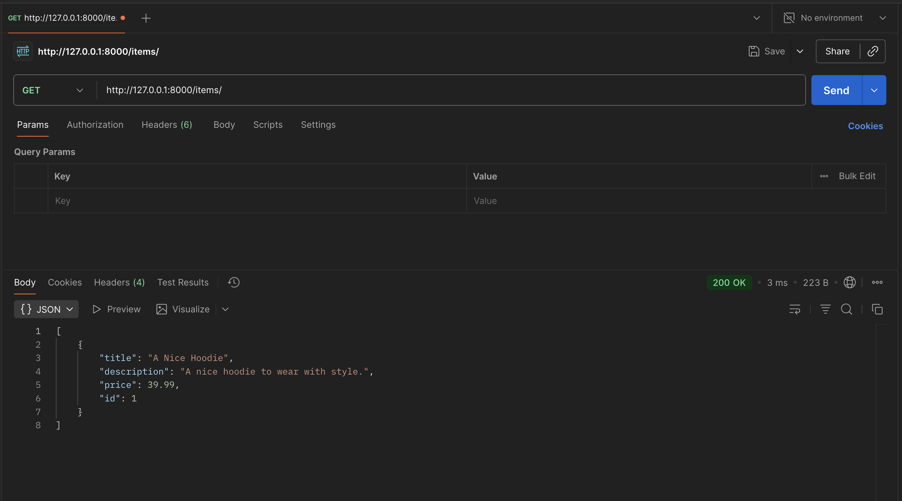

# FastAPI CRUD App
**Contributor:** AksharGoyal

## Description
A fully functional API server that allows CRUD operations powered by SQLAlchemy's Object-Relational Mapping (ORM) feature.

## Tech Stack
- Python
- FastAPI
- SQLAlchemy

## How to Run
1. Install `uv` and make sure you have Python 3.12+.
2. Run `uv venv` to create a virtual environment and then run `source .venv/bin/activate` to activate the virtual environment.
3. Run `uv pip install -r requirements.txt` to install necessary libraries.
4. Run `uv run uvicorn app.main:app --reload` or `uvicorn app.main:app --reload` and open http://127.0.0.1:8000 in a browser. You will get below output:  
```{"detail":"Not Found"}```.  
If you append the endpoint items (`http://127.0.0.1:8000/items/`), you will get an empty list `[]`.
5. You can even get list of items in terminal via cURL: `curl -X GET http://127.0.0.1:8000/items/`.  
6. If you want to add a new item, you may use
```sh
curl -X POST http://127.0.0.1:8000/items/ -H "Content-Type: application/json" -d '{"title":"A Nice Hoodie","description": "A nice hoodie to wear with style.", "price": 39.99}'
```
7. After adding a new item, if you try to GET the items again, you will see our item was added. You can try this on Postman as well.

8. If you made a mistake with the item you created, you can make a PUT request with the id of that item to make that change:  
```sh
curl -X PUT http://127.0.0.1:8000/items/1 -H "Content-Type: application/json" -d '{"title":"A Cool Hoodie","description": "A nice hoodie to wear with style.", "price": 49.99}'
```
9. Finally, if you want to get rid of an item with a particular id, say 1, we can use:  
```sh
curl -X DELETE http://127.0.0.1:8000/items/1
```