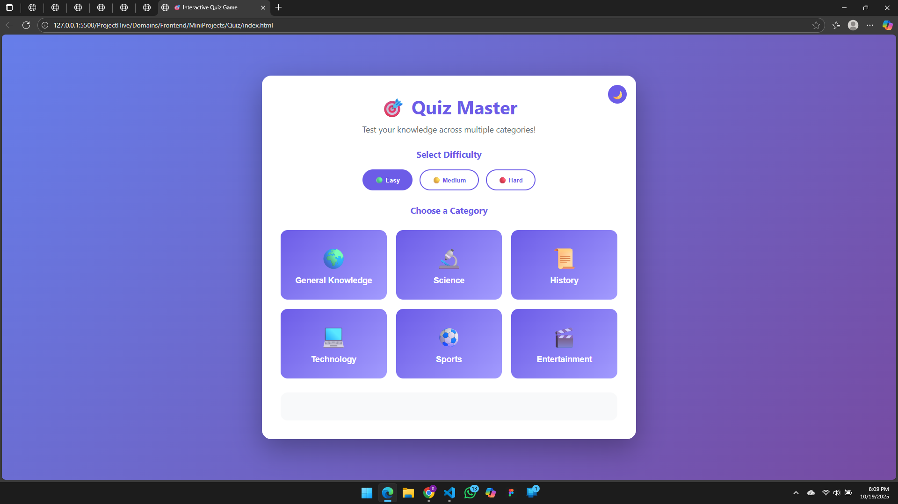

# 🎯 Trivia Quiz Game  
**Contributor:** [Sanjeev Deori](https://github.com/SanjeevDeori)

## 🧠 Description  
A fun and interactive **Trivia Quiz Game** built using **HTML, CSS, and JavaScript**. The game challenges players with multiple categories, difficulty levels, and a timer to make every question count!  

---

## 🚀 Features  
✅ Multiple quiz categories (General, Science, History, etc.)  
✅ 10+ questions per category  
✅ Countdown timer for each question (15–30 seconds)  
✅ Real-time score tracking and final result display  
✅ Progress bar showing question number  
✅ Optional sound effects for correct/wrong answers  
✅ Leaderboard using **localStorage**  
✅ Fully responsive design for mobile and desktop  

---

## 💡 Bonus Features  
✨ Difficulty levels — Easy, Medium, Hard  
✨ Dark/Light mode toggle  
✨ Share your final score on social media  

---

## 🧩 Tech Stack  
- **HTML5** – Structure of the game interface  
- **CSS3** – Styling, animations, and responsive layout  
- **JavaScript (Vanilla)** – Game logic, timer, and interactivity  
- **LocalStorage** – Storing high scores locally  

---

## 🕹️ How to Play  
1. Choose a quiz category and difficulty level.  
2. Answer each question before the timer runs out.  
3. Earn points for each correct answer.  
4. View your score and see where you stand on the leaderboard!  

---

## 📸 Screenshots  


---

## 🏗️ Setup & Run Locally  
1. Clone the repository:  
   ```bash
   git clone https://github.com/SanjeevDeori/Trivia-Quiz-Game.git
2. Open the project folder:
```bash
cd Trivia-Quiz-Game


* Open index.html in your browser to play!