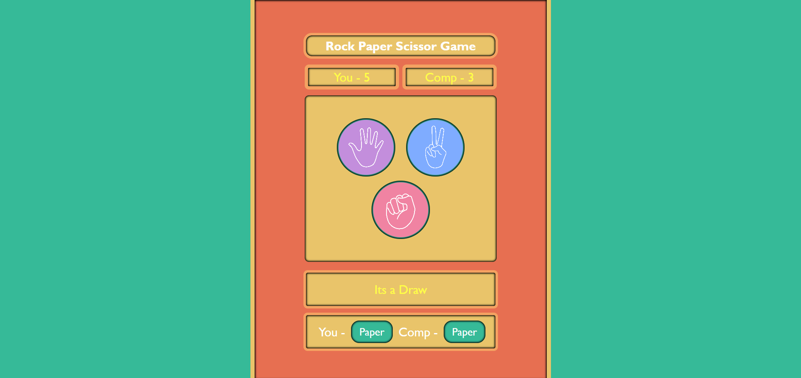

**Contributor:** YourGitHubUsername

# 🎮 Rock-Paper-Scissors Game

A fun and interactive **Rock-Paper-Scissors** game built with **HTML, CSS, and JavaScript**. Play against the computer and test your skills in multiple rounds! 🏆

---

## 📑 Table of Contents

1. [✨ Features](#-features)
2. [🎯 How to Play](#-how-to-play)
3. [📂 Folder Structure](#-folder-structure)
4. [📸 Screenshots](#-screenshots)
5. [📝 License](#-license)

---

## ✨ Features

- 🖥 Play against a computer opponent with random moves
- 🏅 Keep track of scores across multiple rounds
- 💬 Dynamic messages for **win**, **loss**, or **tie**
- 🎨 Clean and responsive interface

---

## 🎯 How to Play

1. Open the `index.html` file in your browser.
2. Click on **Rock ✊**, **Paper ✋**, or **Scissors ✌️** to make your move.
3. The computer will choose randomly.
4. The winner of each round is displayed and scores are tracked automatically.
5. Press **Reset Game 🔄** to start a new match.

---

## 📂 Folder Structure

RockPaperScissors/
├─ index.html # Main HTML file
├─ style.css # Styling for the game
├─ script.js # Game logic
├─ paper.png # Paper image
├─ rock.png # Rock image
├─ scissors.png # Scissors image
├─ rps icon.png # Favicon
└─ README.md # This README file

---

## 📸 Screenshots

---

## 📝 License

This project is licensed under the **MIT License**. See the LICENSE file for details.

---

## 🙏 Thank You

Thanks for checking out my Rock-Paper-Scissors project!  
I hope you enjoy playing it and have fun trying to beat the computer. 🎮✨

Feel free to leave feedback or suggestions for improvement!
